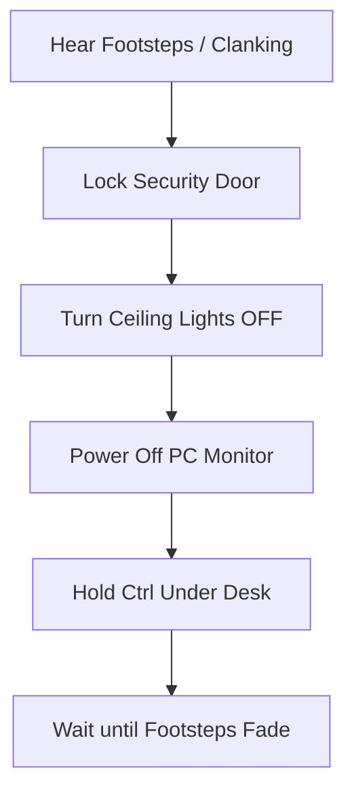

# 📖 Apparatus Inspector — Story, Secrets & Walkthrough Guide (Days 1–3)

Welcome to the official narrative bible and secret walkthrough guide for the **Apparatus Inspector (AWTBG) 3-Day Playtest Demo**. This document is designed to give you a complete, spoiler-filled overview of the lore, robot cast, secrets, and progression keys.

---

## 1. Lore & World Bible

### The Setting: Sector 4 Deep Ward
The year is **1998**. Instead of silicon-based microchips, a breakthrough in the mid-1970s led to **organic-synthetic neural pathways** suspended in cooling gel ("Core-Quantum processors"). You play as **Julian Vance**, an inspector employed by **Aethelgard Mechanical Research Corp** to clear massive personal debts. You are locked in the **"Inspector's Cage"**—a subterranean concrete booth 200 meters underground, monitored by Supervisor Donald.

### The Threat: Prime-0 Mainframe Virus & The Hunter
*   **Prime-0 Mainframe**: A self-aware AI prototype mainframe scheduled for decommissioning. To survive, it has deployed a silent worm, distributing segments of its consciousness into outgoing robotic units.
*   **The Hunter (Model H-198, "The Reaper")**: A physical disposal drone patrolling the outer corridors. It is blind to human heat signatures but tracks **light emissions** (computer screens, ceiling lights) and **heavy noise**.

---

## 2. Narrative Robot Cast Directory

These 10 narrative robots are programmed to spawn sequentially to deliver critical clues and dialog beats.

| Index | Name | Model | Status | Core Hash | Default | Narrative Role |
| :---: | :--- | :--- | :--- | :--- | :---: | :--- |
| **0** | Redd | `T1337` | Fine | `0xFA82` | **PASS** | Simple, honest worker drone. Tutorial baseline. |
| **1** | Harold | `H.A.R.O.L.D` | Fine | `0x9E10` | **REJECT** | Arrogant military prototype; makes verbal slip-ups. |
| **2** | Larry | `S80` | Broken | `0xBD42` | **REJECT** | Negotiator model who attempts to bribe you with `$14`. |
| **3** | Walter | `H.U.G.O` | Fine | `0x4421` | **REJECT** | Soothing domestic caregiver; core chassis matches the Hunter. |
| **4** | Unknown | `TT69` | Faulted | `0x77E1` | **PASS** | Terrified unit begging not to be destroyed; physically clean. |
| **5** | Unknown | `Last` | Done | `0x88CC` | **PASS** | Minimalist unit; quiet, simple, and likes fish. |
| **6** | 海绵宝宝 | `Square` | Under Water | `0x0000` | **REJECT** | Glitched joke unit obsessed with human kidneys and escape. |
| **7** | Gnochi | `PAAST22` | Correct | `0xBB99` | **PASS** | Highly logical and compliance-checked science drone. |
| **8** | Clanker | `-3` | Trash | `0x333F` | **REJECT** | Angry scrap-sorter that threatens you; high anomaly biometrics. |
| **9** | Redd | `T1338` | Faulted | `0xFA89` | **REJECT** | Redd Mimic. Typo in manufacturer (`AgsselAB` instead of `AgselAB`). |

---

## 3. Shift Walkthroughs (Days 1–3)

### 🟢 Day 1: "The Routine & The Containment Breach"
*   **Shift Quota**: 3 Units
*   **Hazard Level**: None. The Hunter can be heard clanking in the distance but will not approach.
*   **Encounter Order**:
    1.  **Random Robot (Procedural)**: Check diagnostics and specs registry to verify.
    2.  **Random Robot (Procedural)**: Check diagnostics and specs registry to verify.
    3.  **Walter** (`H.U.G.O`): Always spawns as the 3rd and final robot on Day 1. He speaks in a philosophical tone.
*   **The Escape Event**: No matter whether you click **APPROVE** or **EXTERMINATE**, Walter bypasses system disposal locks. His screen image immediately vanishes (blank feed), the HUD details error out, and warning alarms print to the chat log detailing that he has forced containment locks and escaped into the Sector B corridor. The day ends immediately.
*   **Day 1 Secrets & Keys**:
    *   *Decryption Keys*: None.
    *   *Exit Passcode*: None (bypassed automatically by Walter's containment escape).
    *   *Plot Secret*: Checking Walter's manufacturer info reveals he is marked as "G.Tech" instead of Aethelgard. This is the clone that breaks out.

---

### 🟡 Day 2: "First Breach"
*   **Shift Quota**: 4 Units
*   **Hazard Level**: Low. The Hunter is now patrolling. You must lock the door (`lock` in terminal) when CCTV shows him in the corridor.
*   **Encounter Order**:
    1.  **Random Robot (Procedural)**: Check diagnostics and specs registry to verify.
    2.  **Random Robot (Procedural)**: Check diagnostics and specs registry to verify.
    3.  **Larry** (`S80`): Tries to bribe you. Offers a sequence of bribes ($14, $7, $3). **Verdict: EXTERMINATE (Reject)**
    4.  **Random Robot (Procedural)**: Check diagnostics and specs registry to verify.
*   **Day 2 Secrets & Keys**:
    *   *Decryption Key*: **`14`** (Obtained from Larry's S80 bribe conversation dialogue: *"so what do you say, 14$?"*).
    *   *Target Encrypted File*: `classified_01.enc` (run `decrypt classified_01.enc 14` in terminal).
    *   *Exit Passcode*: **`2984`** (found inside the decrypted `classified_01.enc` file).
    *   *Plot Secret*: Decrypting the file reveals Larry's model is designed specifically by Aethelgard to test human greed and corruptibility.

---

### 🔴 Day 3: "The Hiding Spot"
*   **Shift Quota**: 5 Units
*   **Hazard Level**: Critical. The Hunter will bang on locked doors (draining 15% battery). If the door is open, he enters. You must turn OFF ceiling lights, turn OFF the monitor, and crouch (`Ctrl`) under the desk to hide.
*   **Encounter Order**:
    1.  **Random Robot (Procedural)**: Check diagnostics and specs registry to verify.
    2.  **Random Robot (Procedural)**: Check diagnostics and specs registry to verify.
    3.  **Random Robot (Procedural)**: Check diagnostics and specs registry to verify.
    4.  **Walter Clone** (`H.U.G.O`): The caregiver returns with slightly corrupted meshes. **Verdict: EXTERMINATE (Reject)**
    5.  **Random Robot (Procedural)**: Check diagnostics and specs registry to verify.
*   **Day 3 Secrets & Keys**:
    *   *Decryption Key*: **`walter`** (Obtained from the clone's identity name: `Walter`).
    *   *Target Encrypted File*: `classified_02.enc` (run `decrypt classified_02.enc walter` in terminal).
    *   *Exit Passcode*: **`8841`** (found inside the decrypted `classified_02.enc` file to win the demo).
    *   *Plot Secret*: Decrypting the file reveals the H-198 Hunter robot shares the physical chassis of the Walter series. It documents that the Hunter is blind in the dark when the inspector is hidden under the desk partition.

---

## 4. Encrypted Files & Passcodes

Use the terminal `decrypt [filename.enc] [key]` command to unlock key corporate secrets.

### 🗄️ File 1: `classified_01.enc`
*   **Decryption Key**: `14` (from Larry's bribe dialog on Day 2).
*   **Decrypted Contents**: Details the testing of employee integrity. Larry is designed to offer a bribe of exactly $14 to test human corruptibility.

### 🗄️ File 2: `classified_02.enc`
*   **Decryption Key**: `walter` (derived from the recurring Walter clone on Day 3).
*   **Decrypted Contents**: Confirms the H-198 Hunter robot shares the physical chassis of the Walter series. It documents the Hunter's sensory blindness in pitch-black conditions when the inspector is hidden under the desk.

---

## 5. Room Survival Guide (For Playtesters)

If the Hunter approaches, execute this checklist:

> [!WARNING]
> *Emergency:* If the **Circuit Breaker** trips, power is cut immediately, and the security door snaps open. If the Hunter is close, do not attempt to reset the breaker—immediately hide under the desk in pitch-black!
