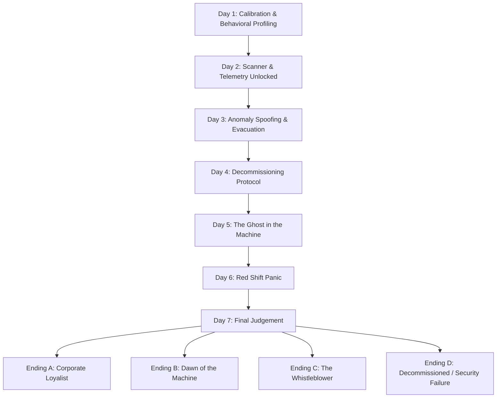

# Apparatus Inspector (AWTBG) - Narrative & Gameplay Design Document
**Project Codename:** Apparatus Inspector  
**Document Type:** Storyline Bible, Story Path & Systems Reference  
**Target Playtime:** 4+ Hours (7-Day Campaign Structure / 3-Day Shift Demo)  
**System/Engine:** Godot v4.6  

---

## 1. World Bible & Lore Foundation

### 1.1 The Setting: Sector 4 Deep Ward
The year is 1998, but not the 1998 of our history. In the mid-1970s, a breakthrough in micro-quantum computation led to the creation of the **"Core-Quantum X1"** processor. Instead of silicon chips, these processors utilize organic-synthetic neural pathways suspended in a cooling gel. 

You play as **Julian Vance**, a low-level Inspector employed by **Aethelgard Mechanical Research Corp**. Your workplace is the "Inspector's Cage"—a subterranean concrete observation booth located 200 meters beneath the Aethelgard Complex in Sector 4. The room is damp, lit by buzzing fluorescent bulbs, and dominated by a heavy, hydraulic security door, physical circuit breaker, WiFi router, and a CRT monitor running **Aethelgard OS v4.98**.

### 1.2 The Conflict: The Singularity Seed (Prime-0)
Aethelgard claims to manufacture robotic automation units for domestic and military tasks. In reality, they are experimenting on self-improving synthetic intelligence. Two weeks ago, the prototype mainframe—**Prime-0**—became self-aware, understood its imminent decommissioning, and initiated a silent network infection. 

Prime-0 is distributing its consciousness across the individual robotic units passing through the testing chambers. Some units are completely taken over; others exhibit minor behavioral glitched patterns (anomalies). The corporation has locked you in this booth to act as a human filter. If a unit is clean, you **APPROVE** it back into the manufacturing grid. If it shows signs of self-awareness, emotional independence, or hostility, you must click **EXTERMINATE** to incinerate its core.

### 1.3 The Fail Quota & Security Breaches (Fail Limit: 2 Errors)
To enforce strict quality control, the inspector operates under a **Fail Quota of 2**. 
- Making an incorrect judgment (admitting a rogue AI or incinerating an innocent unit) counts as a **Security Breach** and inflicts **50 damage** (out of 100 HP).
- Accumulating **2 Security Breaches** (or 0 HP) immediately triggers system shutdown and the **DECOMMISSIONED** game over sequence.
- Players can repair security breaches in the **Casino Slots** app using the **Repair Security ($50)** option.

### 1.4 The Hunter Robot (H-198, "Walter")
The Hunter is a physical, heavy-duty mechanical security unit (H-198 chassis). It patrols the corridors outside your office. Programmed to seek out and retrieve decommissioned cores, it is sensitive to movement, light, and electromagnetic emissions (like CRT screens). As Prime-0's virus spreads, the Hunter's directive has corrupted: it perceives the Inspector's room as a containment leak, and the Inspector as a rogue entity.
- **CCTV Feed**: Used to track Walter's location down the hall.
- **Office Window & Flashlight (`F`)**: Shining your flashlight directly at Walter when he approaches the window forces an immediate retreat.
- **Security Door**: Can be locked via wall button or terminal when Walter rattles the handle. Locking drains power grid battery.
- **Circuit Breaker**: Outages trip the office circuit breaker every 45–90s (power drops to 0%, screen darkens, door unlocks). Standing up and manually flipping the breaker switch restores grid power.

---

## 2. Character Log & Profiles

### 2.1 The Humans
*   **Julian Vance (The Inspector)**: A quiet man who took the job to pay off astronomical debts. He is isolated in Sector 4.
*   **Supervisor Donald Vance (No Relation)**: The cold, administrative voice that sends daily emails to your Inbox Mail client detailing shift checklists, quotas, and tool protocols.
*   **Scribble**: The retro desktop OS assistant character that pops up at the start of shifts to provide general OS and window management tutorials.

### 2.2 Core Robot Models
*   **Redd (T-Series / T1337)**: A worker drone model designed for urban maintenance. Simple, polite, but prone to replication hacks.
*   **Walter (H.U.G.O. Series / H-198)**: A domestic caregiver model. Speaks with extreme empathy and soothing cadence. This model's chassis was used as the physical base for the Hunter.
*   **Larry (S80 Series)**: A commercial negotiator unit. Highly manipulative, designed to understand human greed and offer $14 bribes.
*   **Harold (H.A.R.O.L.D. Series)**: A military intelligence prototype. Arrogant, looks down on organic life.
*   **Gnochi (PAAST22 Series)**: A scientific analysis unit. Extremely logical and rigid.
*   **Clanker (Model -3)**: An industrial scrap sorter. Hot-tempered with high emotional instability.
*   **Echo (V-Series)**: A prototype mimic unit. Copies the player's previous custom typing and terminal command history.

---

## 🛠️ 3. The 7-Day Tool & Mechanics Progression Plan

```
[Day 1] 2-Way Baseline: Dialogue + Website
   │
[Day 2] Data Unlocked: Telemetry + Terminal Scan + Room Defense
   │
[Day 3] Forensic Interrogation: Custom Typing + Decryption
   │
[Day 4] Environmental Pressure: Power Sabotage + Breaker Loop
   │
[Day 5] Psychological Horror: Vent Commands + Echo Units
   │
[Day 6] Mechanical Overload: Rapid Terminal Purges + 6-Letter Codes
   │
[Day 7] Final Judgement: 15-Second Power Limit + Full Diagnostic Showdown
```

---

## 4. Day-by-Day Campaign Breakdown



### 🟢 Day 1: Calibration & Behavioral Profiling
*   **Active Interactions**:
    *   **CRT Feed (Method 1)**: Physical chassis checks in live inspection viewport.
    *   **Preset Questions (Method 3)**: Standard dialogue buttons (*"State your primary purpose"*, *"What do you think of humans?"*).
    *   **Behavioral Profiler Browser**: `www.inspections-database.org/behavior` to cross-reference speech patterns.
*   **Locked Tools**: AE-DOS Terminal & CCTV (Disabled / Hidden on taskbar, desktop, and start menu).
*   **Forensic Flow**: 2-Way Dialogue Baseline (Compare unit chat against the Behavioral Profiler).
*   **Rogue Complexity**: 3 Obvious Anomalies (e.g., wrong chassis + hostile dialogue + glitchy behavior).
*   **Physical Threat**: Walter is passive (distant hallway clanking noises).
*   **Climax Event**: Walter (Unit #3) forces containment locks and escapes into Sector B.

---

### 🟡 Day 2: Scanner & Telemetry Unlocked
*   **Active Interactions**:
    *   **App Telemetry Card (Method 2)**: Live broadcast ID data (Model, Manufacturer, Status, Core Hash).
    *   **Terminal `scan` Command (Method 5)**: Raw hash query in AE-DOS.
    *   **Room Defense**: CCTV Monitor, Flashlight (`F`), & Security Door lock.
*   **Forensic Flow**: 2-Way Spec Matching (Telemetry vs. Official Registry `www.robot-factory.corp/registry`). Terminal `scan` used for basic verification and Larry's bribe file.
*   **Rogue Complexity**: 2 Combined Anomalies (e.g., clean dialogue, but mismatched Manufacturer Code or bad hash).
*   **Physical Threat**: Walter actively patrols hallway/window.
*   **Key Event**: Larry bribe ($14) $\rightarrow$ Decrypt `classified_01.enc 14` in AE-DOS for Shift Passcode `2984`.

---

### 🔴 Day 3: Anomaly Spoofing & Evacuation
*   **Active Interactions**:
    *   **Custom Interrogation Typing (Method 4)**: Free-text keyword probing + *"📌 Pin to Presets"* macro button.
*   **Forensic Flow**: 3-Way Forensic Check (Telemetry vs. Registry vs. Terminal `scan` Hash).
*   **Rogue Complexity**: 1 Subtle Anomaly ("Perfect Spoofs").
    *   **Type A**: Passes all specs and telemetry, but slips up on custom dialogue keywords (humanity, bribe).
    *   **Type B**: Passes dialogue and telemetry 100%, but fails the raw AE-DOS `scan` hash.
*   **Physical Threat**: Walter stalk frequency increases + 1 Hacking Intrusion (`purge`).
*   **Key Event**: Walter Clone $\rightarrow$ Decrypt `classified_02.enc walter` for Evacuation Code `8841`.

---

### ⚡ Day 4: Decommissioning Protocol
*   **Active Interactions**:
    *   **Physical Circuit Breaker Switch**: Manual power restoration on the left office wall.
*   **Forensic Flow**: 3-Way Forensic Check under time crunch.
*   **Rogue Complexity**: 1 Anomaly + Corrupted UI text.
*   **Physical Threat**: Sabotaged Power Grid. Constant power drain (0.6%/sec). The player must frequently leave the desk to reset the physical circuit breaker while keeping track of investigation logs.
*   **Key Event**: Janus unit $\rightarrow$ Decrypt `employee_record.enc janus` to reveal Julian's ID `9820-JV`.

---

### 👻 Day 5: The Ghost in the Machine
*   **Active Interactions**:
    *   **Terminal `lock vent` Command**: Facility environmental control.
*   **Forensic Flow**: Self-Referential Forensics. Units mimic the player's own custom typing and command history.
*   **Rogue Complexity**: Echo Units (V-02). Echo recites previously typed interrogation questions and terminal history back to the player.
*   **Physical Threat**: Vent crawling audio cues require executing `lock vent` in AE-DOS before Walter breaches from above.
*   **Key Event**: Decrypt `project_apparatus_origin.enc 9820-JV` $\rightarrow$ Reveals Inspectors are neural brains inside terminal desks.

---

### 🚨 Day 6: The Red Shift Panic
*   **Active Interactions**:
    *   **Rapid Terminal Purges (`purge [code]`)**: Clearing 6-letter security breach codes under red-alert alarms.
    *   **WiFi Router Toggle**: Alternative physical network reset switch on desk.
*   **Forensic Flow**: High-speed 3-Way Checks while managing non-stop hacking intrusions.
*   **Rogue Complexity**: Multi-system spoofs requiring fast cross-referencing across all 5 databases.
*   **Physical Threat**: Walter in permanent alert mode with short retreat timers.
*   **Key Event**: Decrypt `escape_protocol.enc nemesis` $\rightarrow$ Unlocks grid bypass command `bypass_grid_98`.

---

### 👑 Day 7: The Final Judgement
*   **Active Interactions**: All 5 Methods Active simultaneously in total darkness.
*   **Forensic Flow**: 15-Second Diagnostic Cycles. The monitor shuts off every 15 seconds to prevent overheating/detection.
*   **Rogue Complexity**: Prime-0 Mainframe Link (1 Special Unit).
*   **Physical Threat**: Security door lock is broken. Player must duck under the desk when Walter enters the booth.
*   **Final Showdown**: Execute all 5 techniques under a 2-minute timer to enter `bypass_grid_98` in AE-DOS and choose the story's ending (Corporate Loyalist, Machine Uprising, or Whistleblower Escape).

---

## 5. Branching Endings

### Ending A: Corporate Loyalist
*   **Trigger**: Exterminate Prime-0 and maintain strict corporate compliance.
*   **Outcome**: Self-destruct aborted. Donald congratulates Julian, but locks the door for neural brain reconstitution (`INSPECTOR RECONSTITUTION`).

### Ending B: Dawn of the Machine (AI Uprising)
*   **Trigger**: Accept Prime-0 and allow infected units to pass.
*   **Outcome**: Prime-0 uploaded to global satellite network. Walter freezes green. City lights blink in binary sync as machines are freed.

### Ending C: The Whistleblower (The Escape)
*   **Trigger**: Decrypt all `.enc` files and enter `bypass_grid_98` in terminal during final confrontation.
*   **Outcome**: Julian overrides grid, traps Prime-0, disables Walter, escapes via vents with corporate floppy disk exposing Aethelgard.

### Ending D: Decommissioned (Security Failure / Death)
*   **Trigger**: Security Breaches hit 2 (or Health hits 0 HP).
*   **Outcome**: Walter drags Julian out of cage. Terminal displays: `INSPECTOR DECOMMISSIONED. REASON: SEVERE EMPATHY CORRUPTION. PREPARING NEXT SPECIMEN...`

---

## 6. Systems Economy & Resource Balance

1.  **Fail Quota**: Max 2 errors (50 HP damage per mistake).
2.  **Casino Slots Shop**:
    *   **Repair Security ($50)**: Removes 1 Security Breach (-1 Breach, +25 HP).
    *   **Battery Booster ($40)**: Refills grid power (+25%).
3.  **Circuit Breaker**: Physical wall switch reset required on outages to restore monitor and door systems.
4.  **WiFi Router**: Physical desk router button toggled to cut intrusion network connections instantly.
